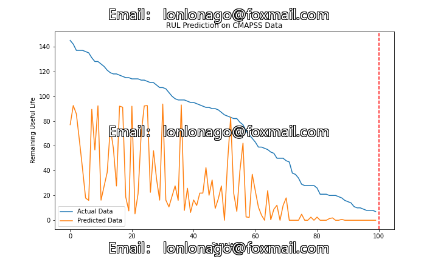

# Enhanced Transformer Encoder Based on Gated Convolutional Units for Remaining Lifespan Prediction (RUL) in NASA Turbine Engine Degradation Simulation Data Set (Python)

The algorithm is executed to predict the remaining lifespan of NASA turbine engine degradation simulation data set using an enhanced Transformer encoder based on gating convolutional units. The compressed package consists of data and code, as well as references. The modules used are listed below:
- python==3.8.8
- numpy==1.20.1
- pandas==1.2.4
- matplotlib==3.3.4
- pytorch==1.8.1

The following code is part of the implementation:
```python
class Transformer(nn.Module):
    def __init__(self, m, d_model, N, heads, dropout):
        super().__init__()
        self.gating = Gating(d_model, m)
        self.encoder = Encoder(d_model, N, heads, m, dropout)
        self.out = nn.Linear(d_model, 1)

    def forward(self, src, t):
        e_i = self.gating(src)
        e_outputs = self.encoder(e_i, t)
        output = self.out(e_outputs)
        return output.reshape(1)
```
The program's output image is as follows:
1. All codes have been tested and there are no issues.
2. Please carefully read the project description before preordering, as it involves different programming languages (Python or MATLAB).
3. As a special product, once sold, returns are not accepted. If you encounter any issues, please contact us in time.
5. Due to circumstances, this code will not be explained during the trip.

## Images



Here is a pay link on Stripe ( https://buy.stripe.com/3cs8yP7sY87d0vu9AB ). Please contact me lonlonago@foxmail.com after funding $89, and I will send you a complete data files , thank you!


